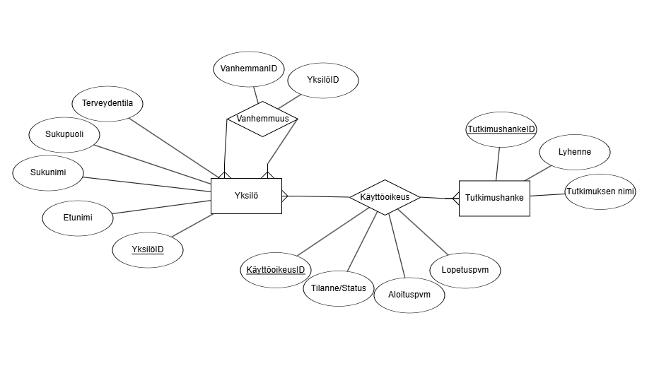
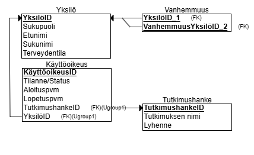

# Assignment 2 - Onni Kivinen

ER-Diagram

Relational Schema:

Sukupuussa ylhäältä alaspain:

| YksilöID | Etunimi | Sukunimi | Sukupuoli | Terveydentila |
| :------- | :------ | :------- | :-------- | :------------ |
| 1        | N/A     | N/A      | M         | terve         |
| 2        | N/A     | N/A      | N         | sairas        |
| 3        | N/A     | N/A      | M         | terve         |
| 4        | N/A     | N/A      | N         | sairas        |
| 5        | N/A     | N/A      | M         | sairas        |
| 6        | N/A     | N/A      | N         | terve         |
| 7        | N/A     | N/A      | M         | terve         |
| 8        | N/A     | N/A      | M         | terve         |
| 9        | N/A     | N/A      | M         | sairas        |
| 10       | N/A     | N/A      | N         | terve         |
| 11       | N/A     | N/A      | N         | sairas        |
| 12       | N/A     | N/A      | M         | sairas        |
| 13       | N/A     | N/A      | N         | terve         |
| 14       | N/A     | N/A      | M         | sairas        |
| 15       | N/A     | N/A      | M         | sairas        |
| 16       | N/A     | N/A      | M         | terve         |

| VanhemmanID | LapsenID |
| :---------- | :------- |
| 1           | 3        |
| 2           | 3        |
| 1           | 4        |
| 2           | 4        |
| 3           | 5        |

...

## Tutkimushanke

| TutkimusHankeID | Lyhenne | Nimi                        |
| :-------------- | :------ | :-------------------------- |
| 1               | CC1     | Cancer Cohort 1             |
| 2               | BRD2000 | Birth Registry Dataset 2000 |

## Käyttöoikeus

| YksilöID | TutkimusHankeID | Alkupvm    | Loppupvm  |
| :------- | :-------------- | :--------- | :-------- |
| 10       | 1               | 1.1.2021   | 21.6.2021 |
| 10       | 2               | 29.10.2025 | NULL      |
