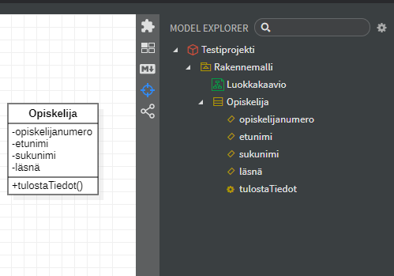

# Assignment 5 - Onni Kivinen

**T2**



**T3**

- Tiedoston tallentaminen PNG- tai JPG muotoon:

  - `File > Export Diagram As > PNG... tai JPG...`

- Tekstieditorissa fragmentin/mfj-tiedoston avaamisen myötä huomaa että data on puhtaasti **JSON-muodossa**.

```json
{
  "_type": "UMLClass",
  "_id": "AAAAAAGaXprXBOgZ+Vc=",
  "_parent": {
    "$ref": "AAAAAAFF+qBWK6M3Z8Y="
  },
  "name": "Opiskelija",
  "attributes": [
    {
      "_type": "UMLAttribute",
      "_id": "AAAAAAGaXpu9p+hIQng=",
      "_parent": {
        "$ref": "AAAAAAGaXprXBOgZ+Vc="
      },
      "name": "opiskelijanumero",
      "visibility": "private"
    },
    {
      "_type": "UMLAttribute",
      "_id": "AAAAAAGaXpvgQ+hQPKI=",
      "_parent": {
        "$ref": "AAAAAAGaXprXBOgZ+Vc="
      },
      "name": "etunimi",
      "visibility": "private"
    },
    {
      "_type": "UMLAttribute",
      "_id": "AAAAAAGaXpvx4uhXoX0=",
      "_parent": {
        "$ref": "AAAAAAGaXprXBOgZ+Vc="
      },
      "name": "sukunimi",
      "visibility": "private"
    },
    {
      "_type": "UMLAttribute",
      "_id": "AAAAAAGaXpwJW+hegtk=",
      "_parent": {
        "$ref": "AAAAAAGaXprXBOgZ+Vc="
      },
      "name": "läsnä",
      "visibility": "private"
    }
  ],
  "operations": [
    {
      "_type": "UMLOperation",
      "_id": "AAAAAAGaXpwgBehlZGg=",
      "_parent": {
        "$ref": "AAAAAAGaXprXBOgZ+Vc="
      },
      "name": "tulostaTiedot"
    }
  ]
}
```
